# 🍌 LPB Nano Banana - AI 图像生成器

一个基于 Next.js 和 Supabase 构建的现代化 AI 图像生成应用，支持文生图和图生图功能。

## ✨ 功能特性

- 🎨 **文生图模式** - 通过文字描述生成图像
- 🖼️ **图生图模式** - 基于参考图片和提示词生成新图像
- 📱 **响应式设计** - 完美适配 PC 端和移动端
- 📊 **生成历史** - 查看和管理历史生成记录
- 🎯 **现代化 UI** - 采用 Tailwind CSS 和 Radix UI 组件

## 🛠️ 技术栈

### 前端
- **Next.js 15.5.2** - React 全栈框架
- **React 19.1.0** - 用户界面库
- **TypeScript** - 类型安全的 JavaScript
- **Tailwind CSS 4** - 原子化 CSS 框架
- **Radix UI** - 无障碍的 UI 组件库
- **Lucide React** - 现代化图标库

### 后端与数据库
- **Supabase** - 后端即服务平台
- **PostgreSQL** - 关系型数据库

## 🎯 核心功能

### 文生图模式
- 输入文字描述
- 调整生成参数
- 获得 AI 生成的图像

### 图生图模式
- 上传参考图片
- 添加提示词描述
- 基于参考图生成新图像

### 生成历史
- 查看所有历史生成记录
- 按时间排序显示
- 支持不同生成类型筛选

## 📦 安装部署

### 0，获取OpenRouter API Key

[点击打开OpenRouter](https://openrouter.ai/)

获取API Key教程先留空

### 1. **Fork 项目**

点击项目页面右上角的 "`Fork`" 按钮创建自己的项目副本。

如图：


项目名称改不改都行，我就不改了，然后点击 `Create fork`


### 2. **注册Supabase和初始化数据库**

注册Supabase账户，创建新的项目。

2.1 打开Supabase官网

地址：[https://supabase.com/](https://supabase.com/)

2.2 登录supabase 

点击页面右上角的 "`Sign in`" 按钮登录。

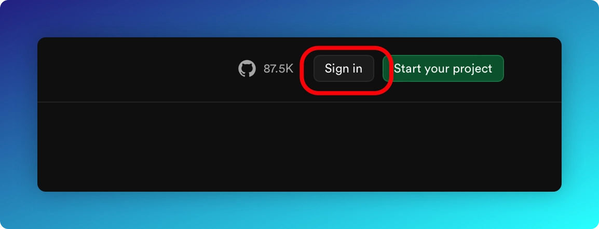

使用Github账号登录。

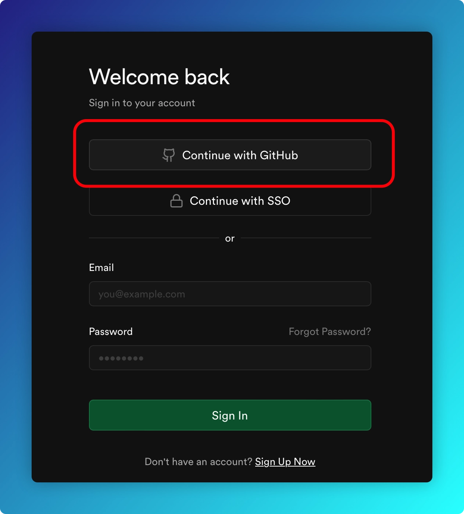

在打开的页面中登录Github账号，然后完成验证。

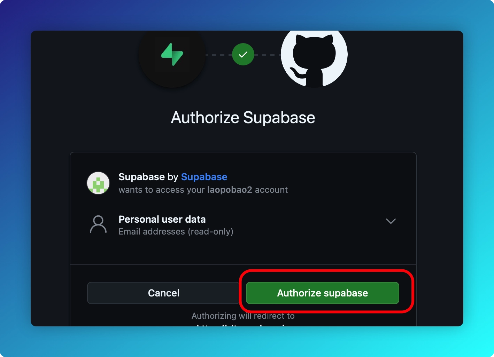

2.3 创建supabase项目

首先会提示你创建一个组织，确定Plan为Free，然后点击 `Create organization`

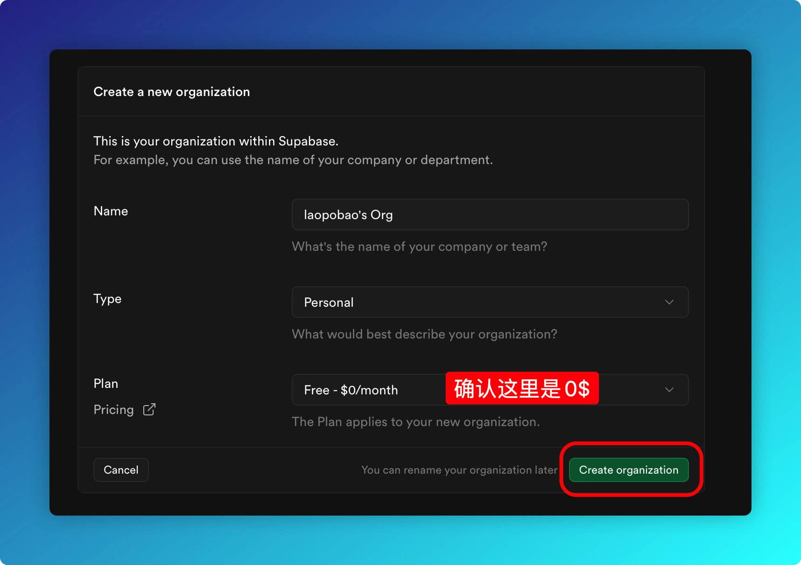

接下来就要创建项目了，注意：

- Project Name：项目名称，自己起一个，我起的是 `sstory`（我之前创建的，你应该自己取个其他的名字，例如`banana`）
- Database password：数据库密码，自己设置一个。
- Region：区域，推荐选择加利福尼亚 `West US(North California)`
- 点击 `Create new project`

项目就创建完成了，如图：

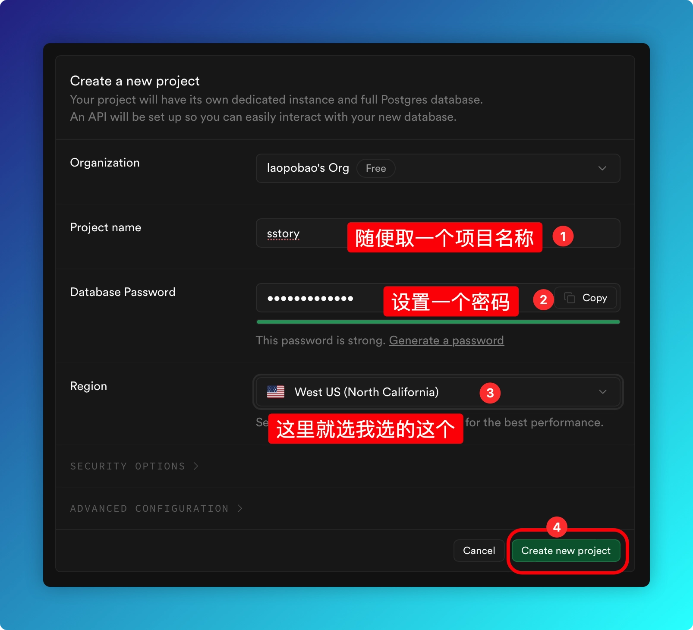

2.4 创建supabase storage

点击左侧边栏的 `Storage`（鼠标划过去会展开）


点击 `New Bucket`

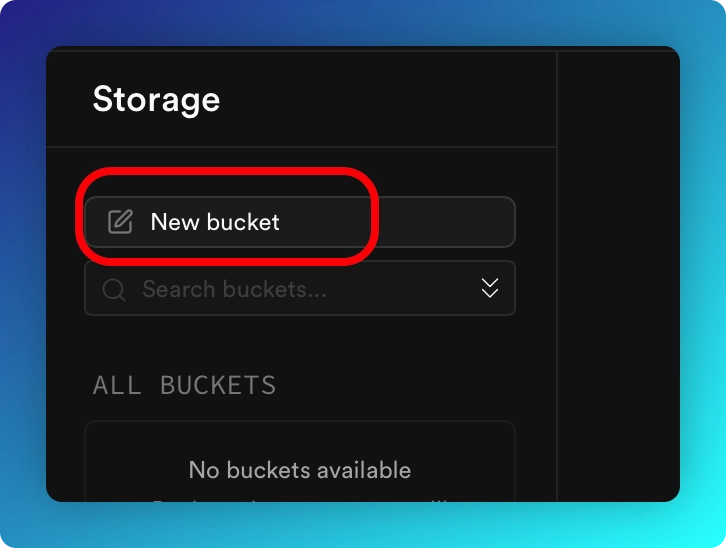

这里需要注意的是：

- Name of bucket：桶名称，必须设置为小写的 `banana`
- Public bucket： `Public`(即打开这个开关)
- 点击 `Create`

这样就完成了存储桶的创建。

2.5 配置初始化数据库

点击侧边栏的`SQL Editer`

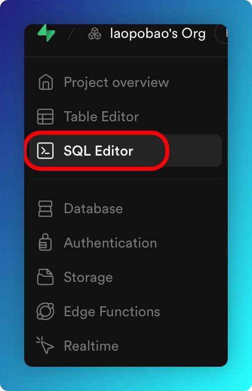

在编辑器窗口粘贴数据库初始化脚本中的内容：

[点击打开数据库初始化脚本](database/database-init.sql)

然后点击`Run`执行。

弹窗提示选择`Run this query`

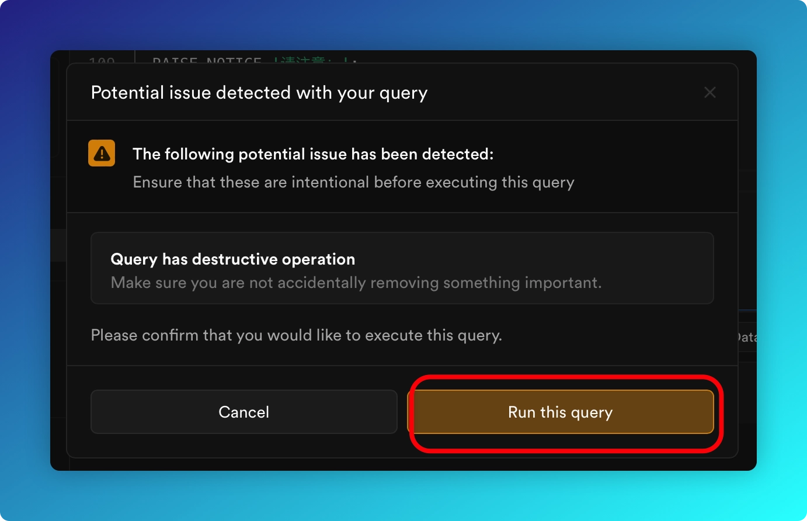

执行完成后，下方会显示 Success. No rows returned.（本来应该输出中文提示的，但是我指令写的不对，不过不影响功能，就不改了。）

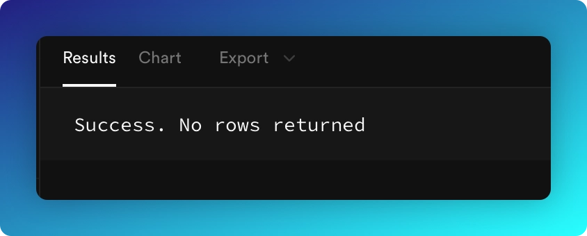

### 3，获取Supabase的连接信息

3.1 获取

点击侧边栏的 `Project Settings`

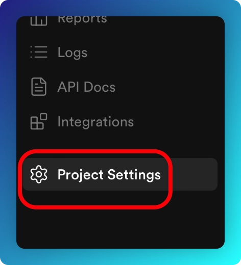

同样在侧边，Settings中选择`Data API`


找到"URL"部分，复制数据库链接，保存好，等下要用。


再在侧边，Settings中选择 API Keys

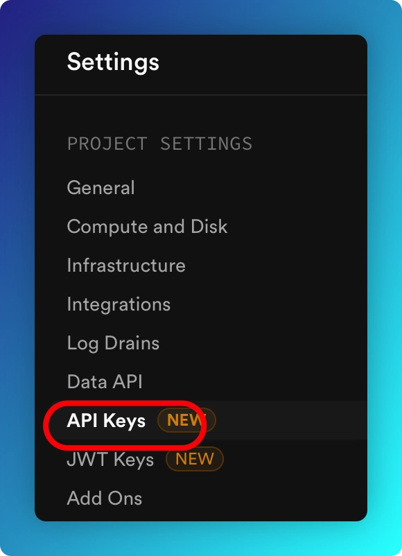

在API Keys页面中，Legacy API Keys标签页里，复制`anon public`和`service_role secret`的值，你把它倆记作ANON KEY和ROLE KEY，保存好，等下要用。

如图：

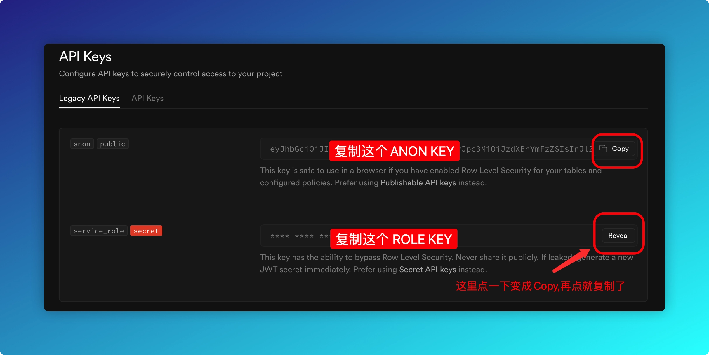

至此，我们在supabase中的操作已经完成了。

### 4，在Vercel上部署

4.1 注册并登录Vercel

打开 Vercel 官网

地址：[https://vercel.com/](https://vercel.com/)

点击页面右上角的 `Sign Up` 按钮注册。


- Plan Type要选择 `Hobby`，这是免费计划。
- Your Name随便输入一个名字。
- 最后点击Continue


在打开的页面中登录Github账号，然后完成验证。


【注意】 如果提示需要手机号验证，那就验证，国内的手机号也可以收到短信的（选择 China +86那个）

4.2 连接到github

为了操作一致，登录完成后，我们关闭页面，再打开一次Vercel（这样的话，界面就和之前创建过账号的界面一致了）

打开vercel，网址：[https://vercel.com/](https://vercel.com/)

点击页面右上角的`Add New`，然后选择`Project`


在Import Git Repository中点击 `Install`

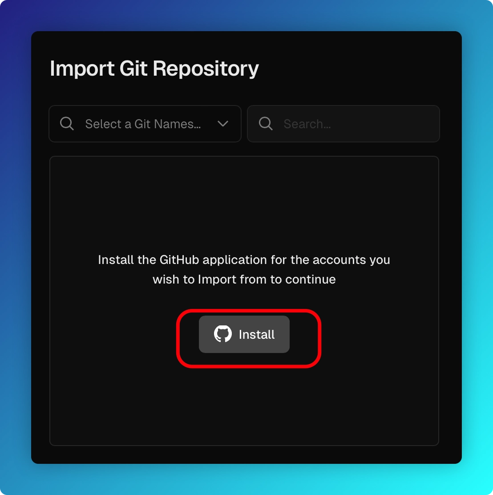

根据提示点击 Install 和验证Github账号就可以了。（可能需要验证邮箱，你和github绑定的邮箱会收到验证码）。

Install安装完毕后，你就可以看到你Github中的项目了。

4.3 部署项目

点击 `Import`，如下图：

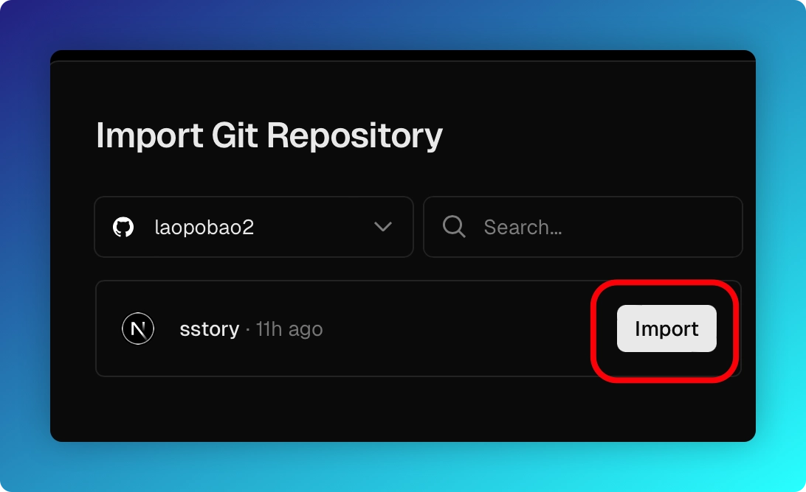

在New Project页面中，点击`Environment Variables`,添加环境变量


你需要添加五个环境变量，如下：

```
# Supabase 配置
NEXT_PUBLIC_SUPABASE_URL
NEXT_PUBLIC_SUPABASE_ANON_KEY
SUPABASE_SERVICE_ROLE_KEY

# 系统访问密码
PASSWORD

# OpenRouter 配置
OPENROUTER_API_KEY
```

其中前三个URL、ANON KEY、和ROLE KEY，之前已经在supabase中获取，保存了吗？保存了就填进去吧。

全部填写完，确认无误后，点击`Depoly`进行部署。


稍微等待一段时间，就部署完成了，我们点击`Continue to Dashboard`就可以来到项目后台。

这里就是访问的网址。

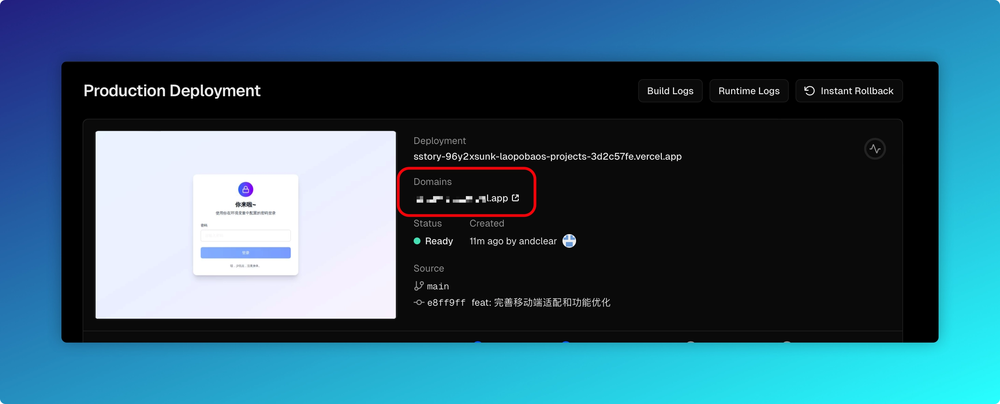

但是注意，这个地址在国内是无法直接访问的，需要挂梯子。

当然，如果你有一个域名托管在Cloudflare，你可以添加DNS解析，就可以无需梯子直接进行访问了。

在Vercel中添加自定义域名的地方在这里：


这就部署完成了！


## 🙏 致谢

本项目参考了 @snaily 大佬的项目界面和功能，使用AI辅助开发。由于 @snaily 大佬的项目没有开源，所以在界面和功能上有一些差异。本项目更针对个人使用。

---

**Nano Banana** - 让 AI 图像生成变得简单而有趣！ 🎨✨